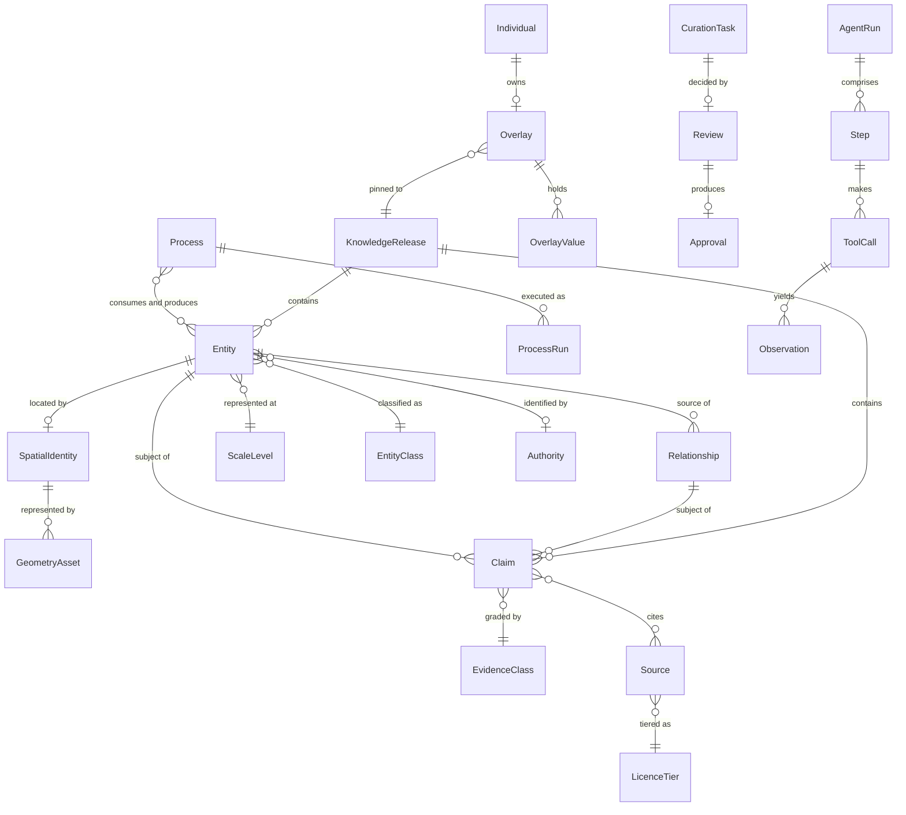

# Data Overview & Core Entities

_The single source of truth for entity names and attributes. FR modules reference
entities by the names defined here. These names are also the names used by
`schemas/` — the JSON Schema files and this table do not drift, because
`biocheck` reads both._

_Greenfield run: no current-state grounding applies. The seed corpus (D-007) is
a source, not an existing system._

## Core Entities
| Entity | Purpose | Owned By (module) | Lifecycle |
|---|---|---|---|
| Entity | a biological thing with identity, class, and level | ONTO | proposed → admitted → retired (tombstoned) |
| EntityClass | the controlled vocabulary of entity classes | ONTO | versioned with the ontology |
| ScaleLevel | an SCL level contract | SCAL | defined at scoping → revised only by Scope Reopen |
| Authority | an external ontology authority and its pinned version | ONTO | registered → pinned per release |
| Relationship | a typed edge between entities | REL | proposed → admitted → retyped or retired |
| RelationshipType | the relation vocabulary, with inverse and admissibility | REL | versioned with the ontology |
| Claim | a graded, sourced assertion | EVID | proposed → under_review → admitted → conflicted/superseded/retired |
| Source | a citable origin with licence and tier | EVID | registered → verified → re-verified per release |
| EvidenceClass | an EVC ladder rung | EVID | defined; changes are a framework-level decision |
| LicenceTier | T0/T1/T2 and what each permits | EVID | defined |
| SpatialIdentity | where an entity is, independent of geometry | SPAT | created with the entity → revised |
| GeometryAsset | a mesh, volume, or point cloud bound to a spatial identity | SPAT | ingested → bound → published → superseded/retired |
| Process | a BPR specification | PHYS | narrative → structured → parameterized → executable |
| ProcessRun | one execution of an executable process | SIM | queued → running → completed/stopped_at_budget/refused/failed |
| NavigationView | a derived tree over the graph | NAV | generated; never authored |
| Query | a search or graph query, saved or transient | SRCH | draft → saved (pinned or floating) |
| RetrievalResponse | a generated answer with its retrieved claim ids | RETR | received → retrieved → generated → grounded/refused/degraded |
| CurationTask | a proposal awaiting review | CUR | queued → in_review → accepted/rejected/blocked/escalated |
| Review | a reviewer's decision with reason and scope | CUR | created; immutable once recorded |
| Approval | the record required for any canonical change | CUR | created at the approval moment; immutable |
| KnowledgeRelease | an immutable, addressable release | VER | draft → validated → published → superseded |
| Individual | the subject of an overlay (Phase 7) | PERS | created → active → deleted (complete, no soft-delete) |
| Overlay | individual data over a pinned reference release (Phase 7) | PERS | empty → active → archived/deleted |
| OverlayValue | one individual value with full provenance (Phase 7) | PERS | appended; superseded, never edited |
| Agent | an agent's definition and its facet contract | AGD | registered → active → retired |
| Task | a unit of work assigned to an agent | AGD | created → assigned → closed |
| Plan | the step sequence an agent forms for a task | AGD | formed → revised → executed |
| AgentRun | one execution of an agent against a task | AGD | queued → planning → executing → completed/stopped/failed |
| Step | one step within a run | AGD | created → executed |
| ToolCall | one tool invocation within a step | AGD | issued → returned/blocked |
| Observation | what an agent perceived after an action | AGD | recorded; immutable |
| Artifact | a product of a step | AGD | produced → referenced |
| Failure | a failure within a run | AGD | recorded; immutable |
| Retry | a retry attempt against a failure | AGD | attempted |
| Compensation | a compensating action for a partial effect | AGD | attempted → succeeded/failed |
| EvaluationRecord | an EV result for a run or a release | AGD, RETR | recorded; immutable |

### Agent runtime objects — naming note
The thirteen rows above (Agent through EvaluationRecord, plus Approval, shared
with curation) are the canonical SPEC_MODEL.md object model, carried verbatim
because this spec scopes agentic modules.

Relationships: Task 1—n AgentRun 1—n Step; Step 0—n ToolCall 1—n Observation;
Step 0—n Artifact; ToolCall 0—1 Approval; Step 0—n Failure 0—n Retry; Failure
0—1 Compensation; AgentRun 0—n EvaluationRecord. `Approval` is shared with the
curation model above — the same record type serves both, because an agent
proposal and a human proposal reach canonical content through the same gate.

## Relationships

**The load-bearing cardinalities:** an Entity has *at most one* SpatialIdentity
and *zero or more* GeometryAssets through it (D-008) — geometry never reaches an
entity directly. An Overlay pins *exactly one* KnowledgeRelease (D-004) and has
no write edge to Entity or Claim at all; the absence of that edge is the
immutability guarantee expressed in the data model rather than in policy.

## Key Attributes per Entity

### Entity
| Attribute | Type | Required | Notes / Constraints |
|---|---|---|---|
| id | string | yes | external term or `HOX:<class>:<slug>` |
| minted | boolean | yes | true if locally minted |
| minted_reason | string | if minted | INV-10 fails on an unflagged minted id |
| entity_class | enum | yes | from EntityClass |
| level | integer 0–10 | yes for structures | single value for located structures |
| spatial_scale | array of integer | yes for spanning processes | ordered; each level within declared depth |
| subsystem | string | yes | governs declared-depth check |
| preferred_term | string | yes | per the level's nomenclature authority |
| synonyms | array | no | each with source and register |
| xrefs | array | no | authority + id + pinned version |
| compilation_status | enum | yes | narrative / structured / mechanistic / parameterized |
| promotion_blocked | boolean | yes | set by an upstream split |
| variant_of | id | no | with a prevalence claim |

### Claim
| Attribute | Type | Required | Notes / Constraints |
|---|---|---|---|
| id | string | yes | |
| subject | id | yes | Entity or Relationship |
| predicate | string | yes | property or relation vocabulary |
| object | id or value | yes | |
| unit | UCUM string | if quantitative | INV-04 |
| evidence_class | enum EVC-1…EVC-8 | yes | |
| sources | array | unless EVC-8 | resolvable identifiers |
| source_type | enum | yes | constrains admissible class |
| species | string | yes | INV-12 |
| transfer_justification | string | if non-human | |
| population | string | yes | `unspecified in source` is a valid, informative value |
| conditions | object | if quantitative | in vivo/vitro, temperature, preparation |
| date_asserted | date | yes | |
| limitations | string | yes | `none identified` must be deliberate |
| conflicts_with | array of id | no | |
| assigned_by | id | yes | human reviewer required for EVC-1/EVC-2 |

### OverlayValue (Phase 7)
| Attribute | Type | Required | Notes / Constraints |
|---|---|---|---|
| target | path | yes | overlay-owned only; INV-08 rejects reference paths |
| value | any | yes | |
| unit | UCUM string | yes | |
| measured_at | timestamp | yes | when measured, not entered |
| method | enum | yes | per data class vocabulary |
| device | string | no | |
| source_rank | enum | yes | clinical → device → self-reported → inferred |
| confidence | enum | yes | derived from method and rank |
| superseded_by | id | no | append-only; never edited |

## Data Classification & Retention
| Entity / Attribute | Classification | Retention | Deletion Path |
|---|---|---|---|
| Entity, Relationship, Claim, Source, Process | public | permanent; releases are immutable | none — superseded, never deleted |
| GeometryAsset | public, licence-bearing | permanent per release | retired, not deleted |
| NavigationView, Query (transient) | internal | derived; regenerable | discard |
| Query (saved), RetrievalResponse | internal | 90 days unless saved | user-initiated |
| CurationTask, Review, Approval | internal | permanent — the audit trail | none; append-only |
| Agent runtime objects | internal | 180 days, then aggregate only | automatic expiry |
| **Individual** | **sensitive — health data** | until deletion requested | complete, verifiable, leaves reference bit-identical |
| **Overlay, OverlayValue** | **sensitive — health data** | until deletion requested | complete; no soft-delete state exists |

Individual data is classified as the most sensitive class the system holds
regardless of whether a given deployment falls under a specific regulatory
regime, per BIO_Personalization_Model §Privacy Posture.

## Volumetrics (order of magnitude)
| Entity | Phase 1 | Phase 3 | Phase 5 |
|---|---|---|---|
| Entity | 10³ | 10⁴ | 10⁵ |
| Relationship | 10³–10⁴ | 10⁵ | 10⁶ |
| Claim | 10⁴ | 10⁵ | 10⁶ |
| GeometryAsset | 10² | 10³ | 10³ |
| Process | 10 | 10² | 10² |
| Overlay (Phase 7) | — | — | 1 per individual, 10²–10³ values each |

These drive three architectural consequences: the graph fits in memory well past
Phase 3, so the store can be chosen for provenance and reproducibility rather
than for scale; claim volume dominates and is the indexing target; and geometry
dominates *bytes* while being a small object count, which is why byte-identical
rebuild (G-07) is at risk from assets rather than from the graph (RSK-12).
