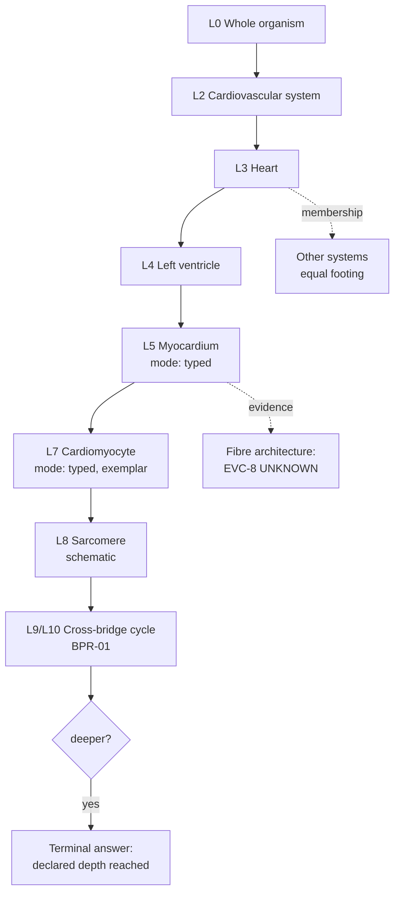
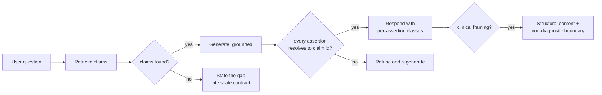

# Detailed User Flows & Use Case Mapping

## Primary User Journeys

### 1. The descent (student, the product's core loop)
A student studying cardiac physiology starts at the whole body and descends to
the mechanism, keeping structure and function together throughout.

1. Explorer at L0 → selects the cardiovascular system (L2). The level indicator
   shows L2, mode `enumerated`, and states that systems are functional groupings,
   not spatial objects (FR-NAV-002).
2. → Heart (L3). Organ mesh, function claims each with an evidence class,
   relations grouped by type.
3. → Left ventricle (L4). Lineage breadcrumb now four deep and fully visible.
4. → Myocardium (L5). **Semantic transition**: mode changes to `typed`, and the
   surface states that tissue is represented as composition, and that fibre
   architecture is known but not represented (EVC-8 on that claim).
5. → Cardiomyocyte (L7). Mode `typed`, one canonical exemplar, marked as such.
6. → Sarcomere (L8). Geometry marked **schematic** at the binding site, not in a
   legend (FR-SPAT-004).
7. → Cross-bridge cycle (L9/L10) via BPR-01. Mechanism as an ordered chain, each
   step in its spatial context, quantities carrying units, conditions, and their
   own evidence classes — visibly weaker than the mechanism they sit inside
   (FR-PHYS-006).
8. Student continues down → **terminal answer**: the model is declared to L10 here
   and holds nothing below, stated as a fact about the model (FR-SCAL-003).

The flow's success condition is not that the student reaches L10. It is that at
every step they knew what kind of thing they were looking at.

### 2. The lateral move (student, the pancreas test)
2a. Student reaches the pancreas from the digestive system.
2b. The membership switcher shows endocrine membership **as an equal**, not as a
    related link (FR-NAV-005).
2c. Selecting it re-frames the same entity in its endocrine context: `produces`
    insulin and glucagon, `responds_to` blood glucose.
2d. Following `affects` → cellular glucose uptake, with the relation type shown.
2e. An `associated_with` edge from the seed corpus is visually distinct and
    labelled as an observed relationship of unstated type, with its prose
    justification (FR-REL-006).

This journey is the acceptance test for D-006 at the interface layer.

### 3. Teaching a mechanism (educator, offline)
3a. Educator searches by function: "what triggers cardiac contraction".
3b. Results carry compilation status and the matching claim's class (FR-SRCH-002).
3c. Opens BPR-01, checks sources in the evidence panel, notes that quantities are
    EVC-3 and rodent-derived — and decides that is fine for teaching mechanism.
3d. Builds a navigation path through the descent (FR-NAV-011), saves it.
3e. Runs it offline in a classroom against a pinned release.
3f. A student asks how precise the calcium numbers are; the educator opens the
    claim record and shows the measurement conditions rather than guessing.

### 4. Extracting a slice (researcher)
4a. Structured query: all L3 cardiovascular entities with EVC-2-or-better function
    claims (FR-SRCH-005).
4b. Reviews results; notices three entities at `narrative` status and excludes them.
4c. Runs a negative-space query on the same scope: what is unknown here
    (FR-SRCH-004).
4d. Exports with full provenance and the licence manifest (FR-SRCH-009).
4e. Six months later, re-runs the saved query against a newer release and diffs —
    two claims changed class, one gained a conflicting claim (FR-VER-011).

### 5. Curating a claim (domain reviewer)
5a. Reviewer opens the queue, filtered to their competence scope (FR-CUR-004).
5b. A proposal from AGT-2 (Evidence) proposes an EVC-3 claim; its full derivation
    is on the review surface — sources, tool calls, validation findings
    (FR-CUR-002).
5c. Reviewer judges the source supports EVC-2, upgrades it — an action **only a
    human can take** (FR-EVID-004) — and accepts.
5d. A second proposal conflicts with an existing claim. It enters as a conflict,
    not an overwrite (FR-EVID-006), and routes to two-reviewer adjudication.
5e. A third proposal targets L7 in a subsystem declared to L3. Refused
    automatically before reaching review (FR-SCAL-002); the reviewer sees it in
    the blocked list with the reason, and can request a Scope Reopen.

### 6. Meeting the model's edge (any user)
6a. User asks: "what does the pancreas do at the cellular level?"
6b. The model holds nothing — endocrine is declared to L3.
6c. Response states what is not represented, why, and what the model does hold
    (FR-RETR-003), rather than answering from parametric knowledge (FR-RETR-001).
6d. Offers the Coverage view for the endocrine subsystem.
6e. User sees declared depth L3 and the gap made explicit.

This is the journey most products would treat as a failure state. Here it is a
designed success, and the flow exists to make sure it is designed rather than
defaulted.

## Use Case Table
| ID | Actor | Goal | Trigger | Main Flow | Alternate Flows | Outcome | FR Refs |
|---|---|---|---|---|---|---|---|
| UC-01 | Student | descend from organ to mechanism | studying a system | journey 1 | terminal answer at declared depth | mechanism understood in spatial context | FR-NAV-001, FR-NAV-002, FR-SCAL-003, FR-PHYS-002 |
| UC-02 | Student | reach an entity from every system it belongs to | multi-system organ | journey 2 | arrives via search instead of tree | equal memberships seen | FR-NAV-005, FR-REL-003 |
| UC-03 | Educator | verify a claim before teaching it | preparing a lesson | opens evidence panel, reads record | conflicting claims shown side by side | claim judged, not assumed | FR-EVID-001, FR-EVID-006, FR-EVID-010 |
| UC-04 | Educator | teach offline from a pinned release | classroom without network | journey 3 | release unavailable offline | lesson runs, release-pinned | FR-NAV-006, FR-NAV-011, FR-VER-001 |
| UC-05 | Researcher | extract a provenance-complete slice | building a reference set | journey 4 | scope crosses licence tiers → export tier-split or refused | slice with provenance | FR-SRCH-005, FR-SRCH-009, FR-VER-009 |
| UC-06 | Researcher | find what is not known | mapping open questions | negative-space query | subject never curated → distinguished from "no gaps" | gaps enumerated | FR-SRCH-004, FR-EVID-005 |
| UC-07 | Researcher | track model change over time | revisiting prior work | saved query re-run and diffed | release superseded | changes seen per claim | FR-SRCH-010, FR-VER-011 |
| UC-08 | Reviewer | accept or reject a proposal | queue item | journey 5 | out-of-scope content refused pre-review | canonical change with Approval record | FR-CUR-001, FR-CUR-002, FR-CUR-004 |
| UC-09 | Reviewer | adjudicate conflicting claims | conflict flagged | two-reviewer adjudication | no second reviewer available → holds | adjudication claim, both positions kept | FR-EVID-006, FR-CUR-005 |
| UC-10 | Any user | ask a natural-language question | curiosity | Ask, cited response | no backing claims → gap stated | grounded answer or honest gap | FR-RETR-001, FR-RETR-003 |
| UC-11 | Any user | reach the model's edge | zooming past declared depth | journey 6 | external resources offered | limit understood as the model's, not biology's | FR-SCAL-003, FR-NAV-003 |
| UC-12 | Clinician | search by clinical vocabulary | patient explanation | clinical-term search maps to structures | asks for interpretation → declined with boundary | structures found, no diagnosis | FR-SRCH-008, FR-RETR-005 |
| UC-13 | Operator | see why the pipeline is blocked | queue not moving | operator view: depth, throughput, blocked reasons | throttling engaged | bottleneck identified | FR-CUR-008, FR-CUR-009 |
| UC-14 | Individual (Phase 7) | compare a measured value to reference | after a measurement | overlay resolves, comparison shown with method and confidence | value stale → shown historical | comparison with uncertainty visible | FR-PERS-003, FR-PERS-009 |
| UC-15 | Individual (Phase 7) | delete all personal data | leaving | deletion; reference verified bit-identical | — | no residue, verifiable | FR-PERS-008 |

## Edge Cases & Exceptions
_Cross-flow failures. Per-module edge cases live in each FR file._

| Scenario | Expected Behavior | FR/UC Ref |
|---|---|---|
| A user arrives by deep link with no prior context | full lineage, level, mode, resolution limit, and pinned release all present on arrival — the state must be self-describing | UC-04 |
| The release changes mid-session | the session keeps its release; a new one is offered, never applied | FR-NAV-006 |
| A user zooms physically past what geometry supports | magnification stops at the asset's resolution limit, stated — polygon detail is never shown as anatomy | FR-NAV-001 |
| A user reads the tree as anatomical structure | the tree is labelled a view at every appearance, and multi-membership is visible from any position within it | FR-NAV-004, BRB-30 |
| Geometry fails to load mid-descent | navigation continues on spatial identities; load failure is visually distinct from genuine absence | FR-SPAT-002 |
| A user filters to EVC-1/EVC-2 and the view empties | the count of excluded items is shown; an empty filtered view must not read as "nothing is known" | FR-NAV-007 |
| A student asks a question the model can answer but only from `narrative` content | answered as description with status shown, never as mechanism | FR-RETR-008 |
| A clinically-framed question arrives indirectly ("my father has…") | structural content returned, interpretation declined, boundary stated — the framing does not change the answer | FR-RETR-005, UC-12 |
| A user encounters an `associated_with` edge and asks how one causes the other | the answer states that the relationship type is not established, and shows the prose | FR-REL-006, FR-RETR-009 |
| First-run: a user has no idea what this is | the L0 entry states what the model is, what it holds, and what it does not, with Coverage reachable — the empty-state case here is an orientation case | PRD_Information_Architecture |

## Flow Diagrams

